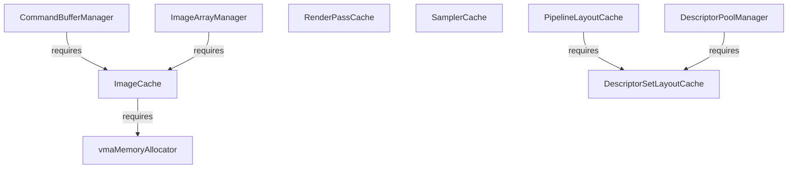

# GVU - Gavin's Vulkan Utilities

This is a set of utility classes/managers which can help organize your vulkan application


## Caches

Holds reusable objects. It works by hashing the CreateInfo struct for the particular Vulkan object. Most of these caches will provide their own CreateInfo struct which is based off the standard Vulkan XXXXCreateInfo. Instead of using raw pointers, the provided CreateInfos will use vectors of objects. These CreateInfo structs are hashable. If two CreateInfo structs are provided and generate the same hash, it will return the previously created object instead of creating a new one.


 * SamplerCache
 * DescriptorSetLayoutCache
 * RenderpassCache
 * PipelineLayoutCache


Most caches work in a simlar fashion. Initialize it with the init() function, and then call the create() function with the appropriate CreateInfo struct. 

Each cache also defines their own CreateInfo struct which is based off the regular vulkan structs. Instead of having to manually set the pointers and manage arrays, these structs provide vectors for each of the member functions. The pointers are automatically set during creation time.

```cpp
gvu::DescriptorSetLayoutCache cache;
cache.init( device );

gvu::DescriptorSetLayoutCreateInfo ci;
ci.bindings.emplace_back(VkDescriptorSetLayoutBinding{0, VK_DESCRIPTOR_TYPE_COMBINED_IMAGE_SAMPLER, 3, VK_SHADER_STAGE_VERTEX_BIT|VK_SHADER_STAGE_FRAGMENT_BIT,nullptr});

auto layout = cache.createDescriptorSetLayout(ci);

cache.destroy();

```


### Image Cache

The Image Cache is used to allocate ALL images in your application. 

**How it Works**: You allocate images from the Image Cache, then when you are finished with it. You can return it to the cache. The image memory is not freed right away. Instead, it is held until you request a new image with the same dimensions/format/usage.

It also provides functions to copy image data from the host.

## Managers

### CommandPoolManager

The *CommandPoolManager* is used to manage command pools and command buffers. 

**How it works**: 

### DescriptorPoolManager

The DescriptorPoolManager, is used to allocate DescriptorSets of a a SINGLE layout. 

**How it works**: After you initialize it with the given layout you want to allocate, the manger will allocate descriptor sets from a pool of a specific size. Once the pool has been exhausted, it will create a new pool.

When you are done with the descriptor set, you can `return` it to the pool. When all descriptor sets from a specific pool have been returned, it will reset the pool.


```cpp
gvu::DescriptorSetLayoutCache dlayoutCache;
gvu::DescriptorPoolManager poolManager;

dlayoutCache.init(window->getDevice());

gvu::DescriptorSetLayoutCreateInfo dci;
dci.bindings.emplace_back(VkDescriptorSetLayoutBinding{0, VK_DESCRIPTOR_TYPE_COMBINED_IMAGE_SAMPLER, 3, VK_SHADER_STAGE_VERTEX_BIT|VK_SHADER_STAGE_FRAGMENT_BIT,nullptr});
dci.bindings.emplace_back(VkDescriptorSetLayoutBinding{1, VK_DESCRIPTOR_TYPE_COMBINED_IMAGE_SAMPLER, 1, VK_SHADER_STAGE_VERTEX_BIT|VK_SHADER_STAGE_FRAGMENT_BIT,nullptr});
auto dLayout1 = dlayoutCache.create(dci);


poolManager.init(window->getDevice(), &dlayoutCache, dLayout1, 3);
```

You probably do not want to use the DescriptorPoolManager on its own. It is used within the `DescriptorSetManager` to manage all descriptor sets.

### DescriptorSetManager

**How it works**: This manger internally handles a DescriptorPoolManager for each layout you want to use. You can allocate descriptor sets by passing it in either a `DescriptorSetLayout` or a `DescriptorSetLayoutCreateInfo` struct.



